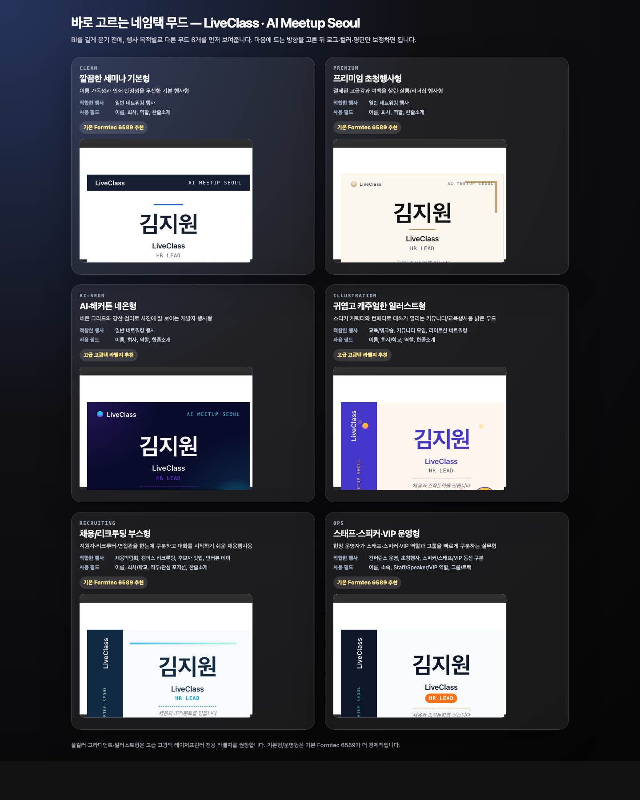

# eventnametag

> **행사 전날, 명단만 넣으면 바로 인쇄 가능한 네임택을 만들어주는 무료 AI 에이전트 스킬.**
> Hermes, Codex, Claude Code 같은 AI 에이전트와 일반 터미널에서 사용할 수 있습니다. 탐사 A4 8칸 라벨지(99×67.5mm) 전용.

[](LICENSE)
[](https://github.com/)

---

## 먼저 결과물 보기

처음부터 YAML이나 내부 템플릿을 고르지 않습니다. 먼저 행사 목적별 제품 카드 8개를 보여주고, 마음에 드는 방향을 고른 뒤 로고·컬러·명단만 보정합니다. 사용자는 내부 레이아웃 ID가 아니라 “이 행사는 이름이 잘 보여야 하는지, 대화가 열려야 하는지, QR 연결이 필요한지”로 선택합니다.

```bash
bin/eventnametag showcase --event "AI Meetup Seoul" --brand-hint "LiveClass"
```



정적 샘플 HTML: `docs/showcase/mood-showcase.html`

쇼케이스 8개:

| 제품 카드 | 적합한 행사 | 강조 정보 | 필요한 필드 | 추천 라벨지 | 인쇄 리스크 |
|---|---|---|---|---|---|
| 이름 가독성 최우선형 | 세미나, 일반 네트워킹, 사내 행사, 등록대에서 빠르게 이름 확인이 필요한 행사 | 이름을 가장 크게, 소속/역할은 보조 정보로 정리 | name, company, role | 기본 탐사 A4 8칸 라벨지 | 낮음 — 흰 여백이 많고 기본 라벨지에서 안정적 |
| 네트워킹·한줄소개형 | 커뮤니티 밋업, 네트워킹 파티, 멤버 교류 행사, 소규모 컨퍼런스 | 한줄소개, 관심사, 대화 시작 단서 | name, company, role, intro, interests | 고급 고광택 레이저프린터 전용 | 보통 — 소개가 길면 글자가 작아지므로 35자 안팎 권장 |
| 채용행사·직무 강조형 | 채용박람회, 캠퍼스 리크루팅, 후보자 밋업, 인터뷰 데이 | 직무, 관심 포지션, 후보자/리크루터 구분 | name, company, role, group, intro | 기본 탐사 A4 8칸 라벨지 | 낮음 — 컬러 면적이 작아 대량 출력에 유리 |
| 스피커·스태프·VIP 구분형 | 컨퍼런스 운영, 초청행사, 스피커/VIP 동선 구분, 스태프 체크인 | Staff/Speaker/VIP 역할, 그룹, 트랙, 동선 구분 | name, company, role, group, track | 기본 탐사 A4 8칸 라벨지 | 낮음 — 운영 배지는 선명하지만 배경 잉크 사용량은 제한 |
| AI·해커톤 에너지형 | AI 밋업, 데모데이, 해커톤, 개발자 컨퍼런스, 팀 빌딩 행사 | 팀, 트랙, 프로젝트/데모 키워드, 기술 관심사 | name, company, role, track, interests | 고급 고광택 레이저프린터 전용 | 높음 — 진한 배경과 그라디언트 때문에 대량 인쇄 전 테스트 권장 |
| 프리미엄 살롱형 | 프리미엄 살롱, 리더십 모임, VIP 초청, 투자자/파트너 라운드테이블 | 이름, 소속, 초청 행사명, 과하지 않은 브랜드 무드 | name, company, role | 기본 탐사 A4 8칸 라벨지 | 낮음 — 잉크 사용량이 적고 기본 라벨지에서도 무난 |
| 교육·워크숍 캐주얼형 | 교육, 워크숍, 커뮤니티 온보딩, 사내 러닝데이, 청소년/대학생 프로그램 | 이름, 소속/학교, 참여 그룹, 한줄소개 | name, company, group, intro | 고급 고광택 레이저프린터 전용 | 보통 — 밝은 장식은 안전하지만 색감 확인용 테스트 권장 |
| QR·LinkedIn 연결형 | 네트워킹 행사, 채용 행사, 글로벌 컨퍼런스, 크리에이터/창업자 밋업 | 이름, 소속, QR/LinkedIn URL, 짧은 연결 문구 | name, company, role, qr_url, intro | 기본 탐사 A4 8칸 라벨지 | 보통 — QR은 너무 작으면 인식률이 떨어져 사전 스캔 테스트 필요 |

## 무엇
행사 전날, 명단만 넣으면 주최측 BI와 행사 무드가 반영된 네임택을 A4 8칸 라벨지에 바로 인쇄할 수 있게 만드는 도구입니다.

핵심은 “예쁜 HTML”이 아니라 아래 첫 성공 경험입니다.

1. 먼저 행사 목적별 쇼케이스 8개로 정보 구조와 분위기를 고른다.
2. 이름·회사·직무·한줄소개 명단을 붙여넣는다.
3. 탐사 A4 8칸 라벨지에 맞춘 HTML/PNG를 만든다.
4. Preview에서 100% 배율로 인쇄한다.

## 언제
- 행사 참석자 명단(이름·회사·직무·소개)이 확정된 시점 (보통 행사 1~2일 전)
- 새 회사·단체 BI를 한 번 등록할 때 (`--register-brand`)
- 라벨지가 떨어졌을 때 (`--order-paper`)
- 현장 등록자용 백지 네임택이 필요할 때 (`--blank`)

## 라벨지 준비물

실제 인쇄 단계에서는 탐사 A4 8칸 라벨지 (99×67.5mm)가 필요합니다. 이 도구의 기본 전제는 “오늘 네임택을 만들고, 라벨지를 오늘 주문해서, 내일 받아 바로 인쇄한다”입니다.

그래서 첫 실행에서 라벨지 보유/주문 여부를 먼저 확인합니다. 라벨지가 없다면 아래 링크로 바로 준비할 수 있습니다.

첫 실행 질문:

```text
📦 라벨지 준비물
네임택을 실제로 붙여 인쇄하려면 탐사 A4 8칸 라벨지 (99×67.5mm)가 필요합니다.
오늘 주문하면 내일 받아서, 만든 네임택을 바로 출력할 수 있습니다.
  1. 쿠팡에서 주문할게요
  2. 라벨지를 이미 가지고 있어요
  3. 일단 preview만 먼저 볼게요
```

- `1`을 고르면 기본 라벨지/고급 고광택 레이저프린터 전용 라벨지 중 하나를 고르고, 구매 링크를 엽니다.
- `2`를 고르면 보유 상태를 저장하고 다음 실행부터 같은 질문을 반복하지 않습니다.
- `3`을 고르면 구매 없이 preview/demo를 먼저 만듭니다. 출력 단계에서는 다시 라벨지와 인쇄 체크리스트를 안내합니다.
- 비대화형 실행(파이프 입력, CI, 에이전트 자동 실행)에서는 입력 대기로 멈추지 않고 진행합니다.

추천 구매 옵션:

- **기본 탐사 A4 8칸 라벨지**: https://link.coupang.com/a/eGNFOI
- **고급 고광택 레이저프린터 전용 라벨지**: https://link.coupang.com/a/eGNNaT

> 이 링크는 쿠팡 파트너스 활동의 일환으로, 이에 따른 일정액의 수수료를 제공받습니다.

## Quick Start

AI 에이전트 안에서 사용할 때는 아래 명령을 사용자가 직접 칠 필요가 없습니다. Agent가 라벨지 준비, 행사 정보, 브랜드 방식, 명단 입력 방식을 `askuser`/선택형 질문으로 확인한 뒤 대신 실행하는 것이 기본 UX입니다.

터미널에서 직접 사용할 때만 아래 CLI 흐름을 따르면 됩니다.

### 1. 의존성 설치

```bash
# 시스템 의존성
#   - macOS Preview (기본 제공)
#   - Google Chrome (https://google.com/chrome)
#   - sips (macOS 기본 제공)

# Python 의존성
cd ~/projects/eventnametag
python3 -m venv .venv
source .venv/bin/activate
pip install -r requirements.txt
```

### 2. 첫 확인 — doctor

```bash
$ bin/eventnametag doctor
✓ PyYAML
✓ jsonschema
✓ Pillow(PIL)
✓ Google Chrome
✓ sips
✓ Preview open
상태: 바로 demo/quick 실행 가능
```

### 3. 1분 안에 쇼케이스 보기 — showcase

```bash
$ bin/eventnametag showcase --event "AI Meetup Seoul" --brand-hint "LiveClass"
✓ 행사 무드별 네임택 쇼케이스 생성
  포함: 깔끔한 기본형 / 프리미엄 / AI·해커톤 / 일러스트 / 채용·리크루팅 / 운영형
  미리보기: ~/.claude/tmp/eventnametag/mood-showcase-....html
```

Agent 안에서는 이 쇼케이스가 기본 첫 화면입니다. 사용자가 고른 무드를 기준으로 명단과 브랜드만 보정합니다.

### 4. 샘플 preview — demo

```bash
$ bin/eventnametag demo --html-only
📦 라벨지 준비물
네임택을 실제로 붙여 인쇄하려면 탐사 A4 8칸 라벨지 (99×67.5mm)가 필요합니다.
오늘 주문하면 내일 받아서, 만든 네임택을 바로 출력할 수 있습니다.
  1. 쿠팡에서 주문할게요
  2. 라벨지를 이미 가지고 있어요
  3. 일단 preview만 먼저 볼게요
> 3
✓ 샘플 네임택 preview 생성
  미리보기: ~/.claude/tmp/eventnametag/demo-preview-....html
```

핵심은 구매를 강요하는 것이 아니라, 물리 라벨지가 없으면 내일 인쇄 일정이 막히므로 첫 실행에서 준비 여부를 먼저 확인하는 것입니다.
1번을 선택하면 기본 라벨지와 고급 고광택 레이저프린터 전용 라벨지 중 하나를 고를 수 있습니다.

### 5. 5분 안에 내 행사 네임택 만들기 — quick

```bash
$ bin/eventnametag quick --html-only
행사명을 입력하세요:
> AI Meetup Seoul #3
브랜드/단체 이름이나 URL이 있나요? (없으면 Enter):
> LiveClass
참석자 명단을 붙여넣으세요. Ctrl+D로 종료합니다.
예: 김지원<Tab>LiveClass<Tab>HR Lead<Tab>채용과 조직문화를 만듭니다
> 김지원	LiveClass	HR Lead	채용과 조직문화를 만듭니다
> 박서연	Acme Lab	PM	AI 제품을 기획합니다
> [Ctrl+D]

✓ 명단 2명 파싱
✓ 시안 preview 생성: ~/.claude/tmp/eventnametag/quick-preview-....html
어떤 스타일로 출력할까요?
  1. 안정적인 기본형
  2. 긴 이름/회사명에 유리
> 1
✓ 출력 HTML 생성: ~/.claude/tmp/eventnametag/quick-nametag-....html
```

파이프/자동화 입력도 가능합니다.

```bash
bin/eventnametag quick --event "AI Meetup" --names "김지원,박서연,이도윤" --html-only
```

### 6. BI 등록 (인터뷰 모드)

```bash
$ python3 scripts/generate.py --register-brand
어떻게 BI를 등록하시겠어요?
  1. 직접 yaml 편집  /  2. AI 에이전트 인터뷰  /  3. URL 자동 추출
> 2

🎙️ BI 인터뷰
  회사명? > Acme Lab
  slug? > acme-lab
  주요 색 1 (다크/강조)? > #1a1a2e
  주요 색 2 (배경/라이트)? > #ffffff
  액센트? > #ff6b35
  워드마크? > Acme Lab
  시그니처? (gradient_orb / icon_url / none) > none
  선호 skeleton? > r1, r4

✅ 저장: ~/.config/eventnametag/brands/acme-lab.yaml
```

또는 동봉된 examples 따라쓰기:

```bash
cp brands/examples/minimal-mono.yaml ~/.config/eventnametag/brands/my-brand.yaml
$EDITOR ~/.config/eventnametag/brands/my-brand.yaml
```

### 7. 고급: 등록한 BI로 행사 네임택 만들기

```bash
$ python3 scripts/generate.py --brand acme-lab --event "올핸즈 2026 Q2"
명단 붙여넣기 (Ctrl+D 종료):
> 김지원	Acme Lab	HR Lead	채용 담당
> 박서연	Acme Lab	PM	제품 기획
> [Ctrl+D]

✓ 명단 2명 파싱
🎨 시안 2개 생성 (R1·R4) → 미리보기 자동 오픈
어떤 시안으로 인쇄? [1/2] > 2
📄 PDF → 300dpi PNG → Preview 자동 오픈
   Cmd+P → 크기 조절 100% → 탐사 A4 8칸 라벨지 인쇄
```

### 8. 첫 인쇄 전 정렬 테스트

```bash
$ bin/eventnametag calibrate
```

격자가 그려진 시트가 나오는데, 일반 A4 종이로 먼저 인쇄해서 라벨지에 겹쳐보고 정렬 확인.

### 9. 라벨지 떨어졌을 때

```bash
$ bin/eventnametag order-paper
🛒 쿠팡 라벨지 페이지 자동 오픈
```

## BI 등록 3가지 입구

| 모드 | 적합 사용자 | 진입 |
|---|---|---|
| **(1) yaml 직접 편집** | 개발자·디자인 안목 있는 사용자 | `brands/examples/`를 `~/.config/eventnametag/brands/`로 복사 후 $EDITOR |
| **(2) AI 에이전트 인터뷰** *(default)* | 색·폰트 정도만 알고 있는 사용자 | `--register-brand` → 2번 |
| **(3) URL 자동 추출** *(v0.2 검토)* | "회사 사이트 주면 알아서" 사용자 | `--register-brand` → 3번 |

## 내부 레이아웃 풀

검증된 4개 내부 레이아웃 + 사용자 정의 + AI 생성(opt-in)의 3-layer 구조입니다. 일반 사용자는 이 레이아웃 ID를 직접 고를 필요가 없습니다. AI 에이전트가 행사 무드, 명단 필드 길이, 잉크 사용량, 라벨지 조건을 보고 자동 선택하는 것이 기본 UX입니다.

고급 사용자나 디버깅 상황에서만 아래 ID를 확인합니다.

| ID | 이름 | 특징 | 잉크 사용량 |
|---|---|---|---|
| **R1** | 상단 다크바 | 가장 안정·검증. 보편형. | 보통 |
| **R2** | 좌측 세로 띠 | 컬러 면적 작음, 본문 공간 ↑. 긴 이름·소개에 유리 | 적음 |
| **R3** | 풀블리드 다크 | 임팩트 ↑. 메쉬 그라디언트 옵션 | 많음 ⚠️ |
| **R4** | 미니멀 | bar 없음, 코너 마이크로 브랜딩. 고급감 | 가장 적음 |

자기 회사 시그니처가 위 4개로 표현 안 되면 사용자 정의 레이아웃 추가가 가능합니다. `docs/skeleton-guide.md` 참조.

각 BI yaml에서 `preferred_skeletons`로 내부 후보를 제한할 수 있지만, 기본 제품 UX는 사용자가 ID를 고르는 방식이 아니라 행사 무드/목적을 고르면 에이전트가 내부 레이아웃을 선택하는 방식입니다.

## CLI 옵션

```
bin/eventnametag [COMMAND] [OPTIONS]
python3 scripts/generate.py [COMMAND] [OPTIONS]

예:
  bin/eventnametag showcase --event "AI Meetup" --brand-hint "LiveClass"
  bin/eventnametag quick --event "AI Meetup" --names "김지원,박서연,이도윤" --html-only

짧은 명령:
  demo                   샘플 브랜드+명단으로 즉시 preview 생성
  doctor                 의존성/브랜드/인쇄 환경 점검
  quick                  행사명/브랜드/명단을 묻는 빠른 생성 wizard
  showcase              행사 목적별 8개 제품 카드 쇼케이스 생성
  order-paper            쿠팡 라벨지 재구매 페이지 자동 오픈
  calibrate              탐사 A4 8칸 라벨지 정렬 테스트 시트
  register-brand         새 BI 등록

옵션:
  --brand <slug>          사용할 BI yaml 지정 (필수, --register-brand·--calibrate·--order-paper 외)
  --event <name>          행사명 (예: "AI Meetup #3"). 다크바 우측에 mono 표시
  --file <csv>            CSV 파일 경로
  --names <a,b,c>         이름만 쉼표로 (빠른 모드)

  --demo                  샘플 브랜드+명단으로 즉시 preview 생성
  --doctor                의존성/브랜드/인쇄 환경 점검

  --register-brand        새 BI 등록 (인터뷰 / yaml / URL 추출 분기)
  --order-paper           쿠팡 라벨지 재구매 페이지 자동 오픈
  --calibrate             탐사 A4 8칸 라벨지 정렬 테스트 시트 (skeleton 무관)

  --blank                 백지 네임택 (현장 수기용) 8칸
  --both --spares N       명단 + 예비지 N칸 같이
  --fill-blanks           명단 페이지의 남는 칸을 워드마크만 있는 blank로

  --html-only             HTML만 생성 (디버그·빠른 반복용). 기본은 PDF→300dpi PNG
  --no-contrast-check     컬러 대비 가드(G2) 강행
  --ignore-ink            잉크 커버리지 가드(G3) 강행
  --validate <yaml>       BI yaml schema 검증만 수행 후 종료
```

## 인쇄 가이드

기본 경로는 **Preview로 자동 오픈되는 300dpi PNG → Cmd+P**입니다. 자동 맞춤이 켜지면 라벨 칸이 1–3mm씩 밀릴 수 있으니, 아래 설정을 그대로 확인하세요.


### macOS Preview / 미리보기 설정

1. 생성된 최종 **PNG** 파일을 Preview/미리보기로 엽니다.
   - 기본 생성 경로는 HTML → PDF → **300dpi PNG**입니다.
   - PDF나 HTML을 바로 인쇄하지 말고, 최종 PNG를 인쇄하는 쪽이 가장 안전합니다.
2. `Cmd + P`로 인쇄 창을 엽니다.
3. **용지 크기**를 `A4`로 설정합니다.
   - `Letter`, `자동`, `사용자 설정`이면 라벨 좌표가 틀어질 수 있습니다.
4. **크기 조절** 라디오 버튼을 선택하고 값을 `100%`로 입력합니다.
   - `용지에 맞게 크기 조절`, `Scale to Fit`, `페이지에 맞춤`, `자동 맞춤`은 선택하지 않습니다.
   - 이 옵션이 켜지면 A4 전체가 축소되어 라벨 칸과 네임택 위치가 어긋납니다.
5. **자동 회전**은 해제합니다.
   - A4 세로 방향 그대로 출력해야 합니다.
6. 첫 장은 반드시 **일반 A4 종이**에 테스트 인쇄합니다.
   - 테스트 출력물을 실제 탐사 A4 8칸 라벨지 위에 겹쳐서 8칸 위치가 맞는지 봅니다.
   - 맞으면 라벨지에 인쇄합니다.
   - 전체가 일정하게 밀리면 `bin/eventnametag calibrate`로 보정합니다.

### 인쇄 전 최종 체크리스트

- [ ] 최종 파일은 Preview에 열린 **300dpi PNG**다.
- [ ] 용지 크기는 **A4**다.
- [ ] **크기 조절 100%**다.
- [ ] **용지에 맞게 크기 조절 / Scale to Fit / 자동 맞춤**은 꺼져 있다.
- [ ] **자동 회전**은 꺼져 있다.
- [ ] 첫 장은 일반 A4로 테스트했고, 라벨지와 겹쳐 칸 정렬을 확인했다.
- [ ] 실제 라벨지는 **탐사 A4 8칸 라벨지 / 99×67.5mm**다.

### 정렬이 어긋날 때

- 전체가 오른쪽/왼쪽/위/아래로 일정하게 밀림: `bin/eventnametag calibrate` 실행 후 보정값을 저장합니다.
- 위쪽은 맞는데 아래쪽이 틀어짐: 프린터 배율이나 `용지에 맞게 크기 조절`이 켜졌을 가능성이 큽니다. 100% 설정부터 다시 확인합니다.
- 좌우가 행마다 다르게 틀어짐: 급지 스큐 가능성이 있으니 라벨지를 다시 넣고, 프린터 용지 가이드를 조입니다.

### 왜 raster PNG 경로인가

일부 프린터(예: Sindoh D452)의 PostScript 인터프리터는 **한글 CID 폰트 + CSS 그라디언트** 조합을 처리하다가 `rangecheck offending command: get` 에러로 작업을 버립니다. 내부에서 Chrome `--print-to-pdf`로 PDF를 만들고 `sips`로 300dpi 래스터 PNG로 변환해, PS 변환 시 텍스트 객체·그라디언트 연산을 모두 제거해 이 이슈를 원천 회피합니다.

`--html-only` 플래그를 쓰면 이 단계 없이 HTML만 브라우저에 띄우므로, 폰트 이슈가 없는 환경에서 빠른 반복 작업에 씁니다.

## 가드레일

설계 단계에서 정의된 8가지 silent failure 차단:

| ID | 가드 | 강행 옵션 |
|---|---|---|
| G1 | yaml schema 검증 (jsonschema) | (필수, 강행 X) |
| G2 | 컬러 대비 (WCAG AA 4.5) | `--no-contrast-check` |
| G3 | 잉크 커버리지 raster 분석 | `--ignore-ink` |
| G4 | skeleton ID 검증 + custom 파일 존재 | (필수) |
| G5 | Chrome / sips 의존성 검사 | `--html-only`로 우회 |
| G6 | 명단 파싱 안전망 | (자동 fallback) |
| G7 | state.json 손상 시 백업 후 재생성 | (자동) |
| G8 | `~/.config/eventnametag/` 자동 생성 | (자동) |

원칙: **"인쇄가 망가지면 사용자가 인쇄 후에 알게 하지 말 것."**

## FAQ / 트러블슈팅

### Chrome이 없다고 나옵니다
설치 후 재시도 (https://google.com/chrome). 또는 `--html-only`로 우회 (이 경우 사용자가 직접 브라우저에서 Cmd+P).

### 잉크 커버리지 경고가 떠요
R3(풀블리드) skeleton 선택 시 자주 나옴. R1 또는 R4로 변경하거나 `--ignore-ink`로 강행. 저가 레이저 프린터는 잉크 번짐 위험 있으니 시험 인쇄 권장.

### `rangecheck` 에러
이 스킬은 raster PNG 경로로 자동 회피. 그래도 발생하면 프린터 PostScript 인터프리터가 PDF를 거부한 케이스이므로 다른 프린터로 시도.

### 명단 헤더가 자동 매핑 안 돼요
`scripts/generate.py`의 `HEADER_MAP` 딕셔너리에 헤더 추가:
```python
HEADER_MAP = {
    "이름": "name", "name": "name", ...
    "당신_컬럼명": "name",  # 추가
}
```

### Linux/Windows에서 안 됩니다
v0.1은 macOS 전용 (Preview·sips 의존). Linux는 v0.2 로드맵에 있습니다.

## Non-goals

- ❌ DB 저장 (매번 휘발, CSV가 source of truth)
- ❌ 다른 라벨지 규격 (탐사 A4 8칸 라벨지 전용. 6580·6586 등은 grid 좌표가 다름)
- ❌ Linux/Windows (v0.2 검토)
- ❌ 자동 인쇄 (`lpr` 직접 제출은 드라이버 silent failure가 있음, Preview Cmd+P 위임)
- ❌ 로고 이미지 직접 업로드 (URL 참조만 v1, 로컬 업로드는 v0.2)
- ❌ 컬러 variant within skeleton (yaml 분리로 워크어라운드)

## 변경 이력

- **v0.1** (2026-04 예정) — 초기 출시. 4 skeleton 풀 + BI yaml + 인터뷰 + 한국어 README
- v0.2 — 컬러 variant within skeleton, AI skeleton 생성, 로고 SVG/PNG 업로드, English README, Linux 지원

## 기여

Pull Request 환영. 작은 수정은 바로, 큰 변경은 issue 먼저.

```bash
git clone https://github.com/<user>/eventnametag
cd eventnametag
python3 -m venv .venv && source .venv/bin/activate
pip install -r requirements.txt
# 기여하실 때
```

새 BI를 `brands/examples/`에 PR로 추가하실 때:
- yaml schema 통과 (필수)
- 컬러 대비 WCAG AA (가능하면)
- skeleton별 calibrate 1회 인쇄 검증 결과 (선택)

## 라이선스

[MIT](LICENSE)
