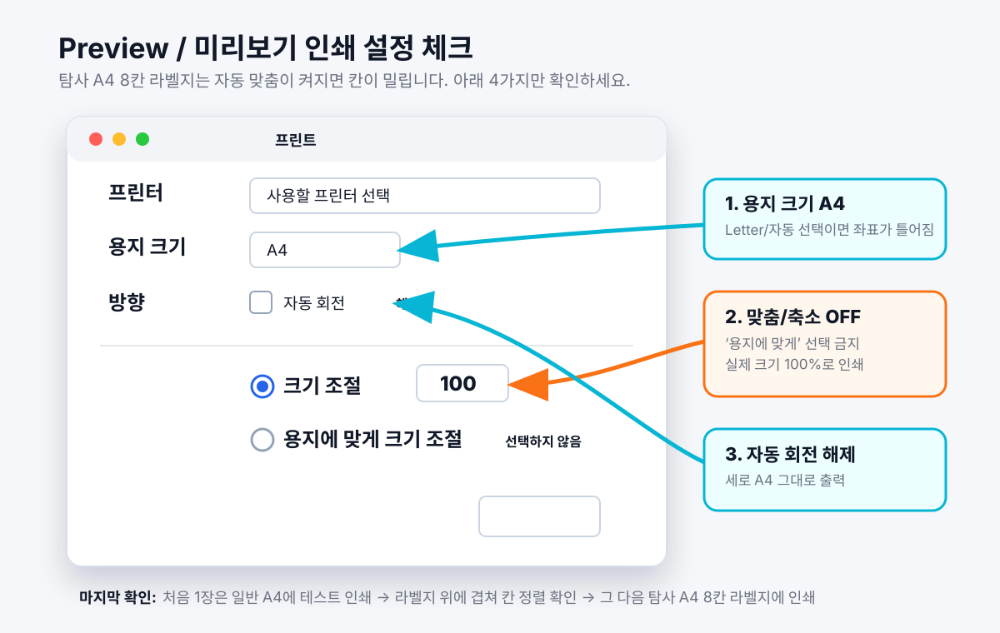

# eventnametag

> **행사 전날 “명찰 어떡하지?”를 끝내는 무료 AI 네임택 제작 스킬.**
> 행사명·브랜드 단서·레퍼런스만 있어도 현장 수기용 네임택을 만들고, 명단이 있으면 참가자별 네임택까지 탐사 A4 8칸 라벨지(99×67.5mm)에 맞춰 바로 인쇄할 수 있게 출력합니다. Hermes, Codex, Claude Code 같은 AI 에이전트와 일반 터미널에서 사용할 수 있습니다.

[](LICENSE)
[](https://github.com/)

---

## 인쇄 가이드

기본 경로는 **Preview로 자동 오픈되는 300dpi PNG → Cmd+P**입니다. 자동 맞춤이 켜지면 라벨 칸이 1–3mm씩 밀릴 수 있으니, 아래 설정을 그대로 확인하세요.



### macOS Preview / 미리보기 설정

1. 생성된 최종 **PNG** 파일을 Preview/미리보기로 엽니다.
   - 기본 생성 경로는 HTML → PDF → **300dpi PNG**입니다.
   - PDF나 HTML을 바로 인쇄하지 말고, 최종 PNG를 인쇄하는 쪽이 가장 안전합니다.
2. `Cmd + P`로 인쇄 창을 엽니다.
3. **용지 크기**를 `A4`로 설정합니다.
   - `Letter`, `자동`, `사용자 설정`이면 라벨 좌표가 틀어질 수 있습니다.
4. **크기 조절** 라디오 버튼을 선택하고 값을 `100%`로 입력합니다.
   - `용지에 맞게 크기 조절`, `Scale to Fit`, `페이지에 맞춤`, `자동 맞춤`은 선택하지 않습니다.
   - 이 옵션이 켜지면 A4 전체가 축소되어 라벨 칸과 네임택 위치가 어긋납니다.
5. **자동 회전**은 해제합니다.
   - A4 세로 방향 그대로 출력해야 합니다.
6. 첫 장은 반드시 **일반 A4 종이**에 테스트 인쇄합니다.
   - 테스트 출력물을 실제 탐사 A4 8칸 라벨지 위에 겹쳐서 8칸 위치가 맞는지 봅니다.
   - 프린터마다 라벨지 인쇄 방향이 다를 수 있습니다. 기존 A4 용지에 펜 등으로 앞/위 방향을 체크해두고, 간단한 테스트 인쇄로 라벨지의 상하·앞뒤 출력 방향을 맞춘 뒤 본 인쇄를 진행하세요! :)
   - 맞으면 라벨지에 인쇄합니다.
   - 전체가 일정하게 밀리면 `bin/eventnametag calibrate`로 보정합니다.

### 인쇄 전 최종 체크리스트

- [ ] 최종 파일은 Preview에 열린 **300dpi PNG**다.
- [ ] 용지 크기는 **A4**다.
- [ ] **크기 조절 100%**다.
- [ ] **용지에 맞게 크기 조절 / Scale to Fit / 자동 맞춤**은 꺼져 있다.
- [ ] **자동 회전**은 꺼져 있다.
- [ ] 첫 장은 일반 A4로 테스트했고, 라벨지와 겹쳐 칸 정렬을 확인했다.
- [ ] 일반 A4에 펜으로 앞/위 방향을 표시해 테스트 인쇄했고, 프린터의 라벨지 상하·앞뒤 급지 방향을 확인했다.
- [ ] 실제 라벨지는 **탐사 A4 8칸 라벨지 / 99×67.5mm**다.

### 정렬이 어긋날 때

- 전체가 오른쪽/왼쪽/위/아래로 일정하게 밀림: `bin/eventnametag calibrate` 실행 후 보정값을 저장합니다.
- 위쪽은 맞는데 아래쪽이 틀어짐: 프린터 배율이나 `용지에 맞게 크기 조절`이 켜졌을 가능성이 큽니다. 100% 설정부터 다시 확인합니다.
- 좌우가 행마다 다르게 틀어짐: 급지 스큐 가능성이 있으니 라벨지를 다시 넣고, 프린터 용지 가이드를 조입니다.

### 왜 raster PNG 경로인가

일부 프린터(예: Sindoh D452)의 PostScript 인터프리터는 **한글 CID 폰트 + CSS 그라디언트** 조합을 처리하다가 `rangecheck offending command: get` 에러로 작업을 버립니다. 내부에서 Chrome `--print-to-pdf`로 PDF를 만들고 `sips`로 300dpi 래스터 PNG로 변환해, PS 변환 시 텍스트 객체·그라디언트 연산을 모두 제거해 이 이슈를 원천 회피합니다.

`--html-only` 플래그를 쓰면 이 단계 없이 HTML만 브라우저에 띄우므로, 폰트 이슈가 없는 환경에서 빠른 반복 작업에 씁니다.

## 무엇
행사 전날, 명단만 넣으면 주최측 BI와 행사 무드가 반영된 네임택을 A4 8칸 라벨지에 바로 인쇄할 수 있게 만드는 도구입니다.

핵심은 “예쁜 HTML”이 아니라 아래 첫 성공 경험입니다.

1. 행사명, 원하는 무드, BI/브랜드 단서, 명단을 자유롭게 입력한다.
2. 이미지, 웹사이트 URL, 로고 파일, 디자인 가이드 md 같은 레퍼런스를 같이 줄 수 있다.
3. 행사 무드는 저잉크 벡터 조형으로 번역하고, 장소·층수·상세 일시 같은 포스터성 정보는 제거한다.
4. 각 네임택에는 주최사/호스트 이름을 반드시 남긴다.
5. 이름·소속 작성 영역은 전체 셀의 최소 2/3에 가깝게 넓게 남기고, 점선/밑줄/칸 구분선은 넣지 않는다.
6. 탐사 A4 8칸 라벨지에 맞춘 HTML/PNG를 만든다.
7. Preview에서 100% 배율로 인쇄한다.

## 언제
- 행사 참석자 명단(이름·회사·직무·소개)이 확정된 시점 (보통 행사 1~2일 전)
- 새 회사·단체 BI를 한 번 등록할 때 (`--register-brand`)
- 라벨지가 떨어졌을 때 (`--order-paper`)
- 현장 등록자용 백지 네임택이 필요할 때 (`--blank`)

## 라벨지 준비물

실제 인쇄 단계에서는 탐사 A4 8칸 라벨지 (99×67.5mm)가 필요합니다. 이 도구의 기본 전제는 “오늘 네임택을 만들고, 라벨지를 오늘 주문해서, 내일 받아 바로 인쇄한다”입니다.

그래서 첫 실행에서 라벨지 보유/주문 여부를 먼저 확인합니다. 라벨지가 없다면 아래 링크로 바로 준비할 수 있습니다.

첫 실행 질문:

```text
탐사 A4 8칸 라벨지 준비 상태를 확인할게요.

  1. 쿠팡에서 주문할게요
  2. 이미 가지고 있어요
  3. 라벨지는 나중에 준비하고, 행사 정보부터 입력할게요
```

Hermes CLI의 긴 한글 선택 질문 박스가 깨질 수 있어, 실제 Agent 질문은 위처럼 짧게 표시합니다. 라벨지 설명은 질문 밖에서 안내합니다.

- `1`을 고르면 Chrome에서 기본 탐사 A4 8칸 라벨지 구매 링크를 바로 엽니다.
- `2`를 고르면 보유 상태를 저장하고 다음 실행부터 같은 질문을 반복하지 않습니다.
- `3`을 고르면 구매 없이 행사 정보 입력으로 이어갑니다. 출력 단계에서는 다시 라벨지와 인쇄 체크리스트를 안내합니다.
- 비대화형 실행(파이프 입력, CI, 에이전트 자동 실행)에서는 입력 대기로 멈추지 않고 진행합니다.

구매 링크:

- **기본 탐사 A4 8칸 라벨지**: https://link.coupang.com/a/eGNFOI

> 이 링크는 쿠팡 파트너스 활동의 일환으로, 이에 따른 일정액의 수수료를 제공받습니다.

## Quick Start

AI 에이전트 안에서 사용할 때는 아래 명령을 사용자가 직접 칠 필요가 없습니다. Agent가 라벨지 준비, 행사 정보, 브랜드 방식, 명단 입력 방식을 `askuser`/선택형 질문으로 확인한 뒤 대신 실행하는 것이 기본 UX입니다.

터미널에서 직접 사용할 때만 아래 CLI 흐름을 따르면 됩니다.

### 1. 의존성 설치

```bash
# 시스템 의존성
#   - macOS Preview (기본 제공)
#   - Google Chrome (https://google.com/chrome)
#   - sips (macOS 기본 제공)

# Python 의존성
cd ~/projects/eventnametag
python3 -m venv .venv
source .venv/bin/activate
pip install -r requirements.txt
```

### 2. 첫 확인 — doctor

```bash
$ bin/eventnametag doctor
✓ PyYAML
✓ jsonschema
✓ Pillow(PIL)
✓ Google Chrome
✓ sips
✓ Preview open
상태: 바로 demo/quick 실행 가능
```

### 3. 샘플 preview — demo

```bash
$ bin/eventnametag demo --html-only
탐사 A4 8칸 라벨지 준비 상태를 확인할게요.

  1. 쿠팡에서 주문할게요
  2. 이미 가지고 있어요
  3. 라벨지는 나중에 준비하고, 행사 정보부터 입력할게요
> 3
✓ 샘플 네임택 preview 생성
  미리보기: ~/.claude/tmp/eventnametag/demo-preview-....html
```

핵심은 구매를 강요하는 것이 아니라, 물리 라벨지가 없으면 내일 인쇄 일정이 막히므로 첫 실행에서 준비 여부를 먼저 확인하는 것입니다.
1번을 선택하면 Chrome에서 기본 탐사 A4 8칸 라벨지 구매 링크가 바로 열립니다.

### 4. 5분 안에 내 행사 네임택 만들기 — quick

```bash
$ bin/eventnametag quick
행사명을 입력하세요:
> AI Meetup Seoul #3
브랜드/단체 이름이나 URL이 있나요? (없으면 Enter):
> LiveClass
참석자 명단을 붙여넣으세요. Ctrl+D로 종료합니다.
예: 김지원<Tab>LiveClass<Tab>HR Lead<Tab>채용과 조직문화를 만듭니다
> 김지원	LiveClass	HR Lead	채용과 조직문화를 만듭니다
> 박서연	Acme Lab	PM	AI 제품을 기획합니다
> [Ctrl+D]

✓ 명단 2명 파싱
✓ 인쇄용 네임택 생성
📄 PDF → 300dpi PNG → Preview 자동 오픈
```

`quick`은 “바로 만들어줘” 경로이므로 별도 preview 탭을 열지 않습니다. 디자인 비교가 필요할 때만 `showcase`/`demo`를 명시적으로 사용합니다.

파이프/자동화 입력도 가능합니다.

```bash
bin/eventnametag quick --event "AI Meetup" --names "김지원,박서연,이도윤"
```

### 5. BI 등록 (인터뷰 모드)

```bash
$ python3 scripts/generate.py --register-brand
어떻게 BI를 등록하시겠어요?
  1. 직접 yaml 편집  /  2. AI 에이전트 인터뷰  /  3. URL 자동 추출
> 2

🎙️ BI 인터뷰
  회사명? > Acme Lab
  slug? > acme-lab
  주요 색 1 (다크/강조)? > #1a1a2e
  주요 색 2 (배경/라이트)? > #ffffff
  액센트? > #ff6b35
  워드마크? > Acme Lab
  시그니처? (gradient_orb / icon_url / none) > none

✅ 저장: ~/.config/eventnametag/brands/acme-lab.yaml
```

또는 동봉된 examples 따라쓰기:

```bash
cp brands/examples/minimal-mono.yaml ~/.config/eventnametag/brands/my-brand.yaml
$EDITOR ~/.config/eventnametag/brands/my-brand.yaml
```

### 6. 등록한 BI로 행사 네임택 만들기

```bash
$ python3 scripts/generate.py --brand acme-lab --event "올핸즈 2026 Q2"
명단 붙여넣기 (Ctrl+D 종료):
> 김지원	Acme Lab	HR Lead	채용 담당
> 박서연	Acme Lab	PM	제품 기획
> [Ctrl+D]

✓ 명단 2명 파싱
✓ 행사 무드와 BI 기반 네임택 생성
📄 PDF → 300dpi PNG → Preview 자동 오픈
   Cmd+P → 크기 조절 100% → 탐사 A4 8칸 라벨지 인쇄
```

### 7. 첫 인쇄 전 정렬 테스트

```bash
$ bin/eventnametag calibrate
```

격자가 그려진 시트가 나오는데, 일반 A4 종이로 먼저 인쇄해서 라벨지에 겹쳐보고 정렬 확인.

### 8. 라벨지 떨어졌을 때

```bash
$ bin/eventnametag order-paper
🛒 쿠팡 라벨지 페이지 자동 오픈
```

## BI 등록 3가지 입구

| 모드 | 적합 사용자 | 진입 |
|---|---|---|
| **(1) yaml 직접 편집** | 개발자·디자인 안목 있는 사용자 | `brands/examples/`를 `~/.config/eventnametag/brands/`로 복사 후 $EDITOR |
| **(2) AI 에이전트 인터뷰** *(default)* | 색·폰트 정도만 알고 있는 사용자 | `--register-brand` → 2번 |
| **(3) URL 자동 추출** | "회사 사이트 주면 알아서" 사용자 | `--register-brand` → 3번 |

## 내부 안전 fallback

일반 사용자는 내부 레이아웃을 직접 고를 필요가 없습니다. 현재 핵심 기능은 **행사 무드와 BI를 반영한 AI 셀 템플릿 생성**이고, 내부 레이아웃은 AI 템플릿이 인쇄 안전 기준을 통과하지 못할 때만 쓰는 안전장치입니다.

AI 셀 템플릿은 아래 조건을 통과해야 렌더됩니다. 실패하면 도구가 조용히 안전 fallback으로 바꿔 인쇄 실패를 막습니다.

- `{{name}}` 필수
- `{{organizer}}` 또는 `{{host}}` 필수 — 주최사/호스트명
- 작성 공백은 전체 셀의 최소 2/3에 가까운 넓은 영역
- 공백 작성란에 점선/밑줄/칸 구분선 금지
- 장소명·주소·층수·상세 일시 같은 포스터성 정보 금지
- 그라데이션·사진·풀블리드·대면적 진한 배경 금지
- 색/폰트는 브랜드 토큰만 사용

즉, README에서 내부 레이아웃을 사용자가 선택해야 하는 기능처럼 설명하지 않습니다. 그것들은 제품 기능이 아니라 실패 방지용 내부 구현입니다.

## CLI 옵션

```
bin/eventnametag [COMMAND] [OPTIONS]
python3 scripts/generate.py [COMMAND] [OPTIONS]

예:
  bin/eventnametag quick --event "AI Meetup" --names "김지원,박서연,이도윤"
  bin/eventnametag showcase --event "AI Meetup" --brand-hint "LiveClass"  # 선택: 샘플/디버그

짧은 명령:
  demo                   샘플 브랜드+명단으로 즉시 preview 생성
  doctor                 의존성/브랜드/인쇄 환경 점검
  quick                  행사명/브랜드/명단을 묻는 빠른 생성 wizard
  showcase              선택 기능: 행사 목적별 샘플/디버그 쇼케이스 생성
  order-paper            쿠팡 라벨지 재구매 페이지 자동 오픈
  calibrate              탐사 A4 8칸 라벨지 정렬 테스트 시트
  register-brand         새 BI 등록

옵션:
  --brand <slug>          사용할 BI yaml 지정. 없으면 quick/showcase/demo에서는 예시/brand-hint로 진행
  --event <name>          행사명 (예: "AI Meetup #3"). 장소/층수보다 무드 식별용으로만 최소 사용
  --file <csv>            CSV 파일 경로
  --names <a,b,c>         이름만 쉼표로 (빠른 모드)

  --demo                  샘플 브랜드+명단으로 즉시 preview 생성
  --doctor                의존성/브랜드/인쇄 환경 점검

  --register-brand        새 BI 등록 (인터뷰 / yaml / URL 추출 분기)
  --order-paper           쿠팡 라벨지 재구매 페이지 자동 오픈
  --calibrate             탐사 A4 8칸 라벨지 정렬 테스트 시트 (skeleton 무관)

  --blank                 백지 네임택 (현장 수기용) 8칸
  --both --spares N       명단 + 예비지 N칸 같이
  --fill-blanks           명단 페이지의 남는 칸을 워드마크만 있는 blank로

  --html-only             HTML만 생성 (디버그·빠른 반복용). 기본은 PDF→300dpi PNG
  --no-contrast-check     컬러 대비 가드(G2) 강행
  --ignore-ink            잉크 커버리지 가드(G3) 강행
  --validate <yaml>       BI yaml schema 검증만 수행 후 종료
```

## 가드레일

현재 차단하는 silent failure:

| ID | 가드 | 강행 옵션 |
|---|---|---|
| G1 | yaml schema 검증 (jsonschema) | (필수, 강행 X) |
| G2 | 컬러 대비 (WCAG AA 4.5) | `--no-contrast-check` |
| G3 | 잉크 커버리지 raster 분석 | `--ignore-ink` |
| G4 | skeleton ID 검증 + custom 파일 존재 | (필수) |
| G5 | Chrome / sips 의존성 검사 | `--html-only`로 우회 |
| G6 | 명단 파싱 안전망 | (자동 fallback) |
| G7 | state.json 손상 시 백업 후 재생성 | (자동) |
| G8 | `~/.config/eventnametag/` 자동 생성 | (자동) |
| G9 | AI 템플릿 textzone 대비/공백 영역 검사 | 안전 floor fallback |
| G10 | AI 템플릿 sanitize: 외부 URL·script·handler·예약 셀렉터 차단 | 안전 floor fallback |
| G11 | 작성 공백 가이드라인 금지: 점선·밑줄·칸 구분선 차단 | 안전 floor fallback |
| G12 | 포스터성 장소 정보 차단: 장소명·주소·층수 제거 | 안전 floor fallback |
| G13 | 주최사/호스트명 필수 슬롯 검사 | 안전 floor fallback |

원칙: **"인쇄가 망가지면 사용자가 인쇄 후에 알게 하지 말 것."**

## FAQ / 트러블슈팅

### Chrome이 없다고 나옵니다
설치 후 재시도 (https://google.com/chrome). 또는 `--html-only`로 우회 (이 경우 사용자가 직접 브라우저에서 Cmd+P).

### 잉크 커버리지 경고가 떠요
강한 다크 무드나 장식이 많은 템플릿에서 자주 나옵니다. 여백이 많은 안전 레이아웃으로 fallback시키거나, 장식을 줄이는 것이 기본 대응입니다. `--ignore-ink` 강행은 테스트 인쇄를 감수할 때만 씁니다.

### `rangecheck` 에러
이 스킬은 raster PNG 경로로 자동 회피. 그래도 발생하면 프린터 PostScript 인터프리터가 PDF를 거부한 케이스이므로 다른 프린터로 시도.

### 명단 헤더가 자동 매핑 안 돼요
`scripts/generate.py`의 `HEADER_MAP` 딕셔너리에 헤더 추가:
```python
HEADER_MAP = {
    "이름": "name", "name": "name", ...
    "당신_컬럼명": "name",  # 추가
}
```

### Linux/Windows에서 안 됩니다
v0.1은 macOS 전용 (Preview·sips 의존). Linux는 v0.2 로드맵에 있습니다.

## Non-goals

- ❌ DB 저장 (매번 휘발, CSV가 source of truth)
- ❌ 다른 라벨지 규격 (탐사 A4 8칸 라벨지 전용. 6580·6586 등은 grid 좌표가 다름)
- ❌ Linux/Windows (v0.2 검토)
- ❌ 자동 인쇄 (`lpr` 직접 제출은 드라이버 silent failure가 있음, Preview Cmd+P 위임)
- ❌ QR 이미지 자동 생성 (현재는 연결 문구/URL 텍스트까지만)
- ❌ 라벨지 밖으로 나가는 풀블리드/테두리 디자인
- ❌ 장소·주소·층수까지 넣는 행사 포스터형 네임택
- ❌ 공백 작성란의 점선/밑줄/칸 구분선

## 변경 이력

- **v0.6** — AI 셀 템플릿 자율 생성 + 안전 floor fallback. 작성 공백 2/3, 점선/밑줄 금지, 장소 정보 금지, 주최사/호스트명 필수 가드 추가.
- v0.5 — 저잉크 벡터 장식, 로고/BI 기반 색 추출, 잉크·대비 게이트 강화.
- v0.1 — 초기 출시. 4 skeleton 풀 + BI yaml + 인터뷰 + 한국어 README.

## 기여

Pull Request 환영. 작은 수정은 바로, 큰 변경은 issue 먼저.

```bash
git clone https://github.com/<user>/eventnametag
cd eventnametag
python3 -m venv .venv && source .venv/bin/activate
pip install -r requirements.txt
# 기여하실 때
```

새 BI를 `brands/examples/`에 PR로 추가하실 때:
- yaml schema 통과 (필수)
- 컬러 대비 WCAG AA (가능하면)
- skeleton별 calibrate 1회 인쇄 검증 결과 (선택)

## 라이선스

[MIT](LICENSE)
